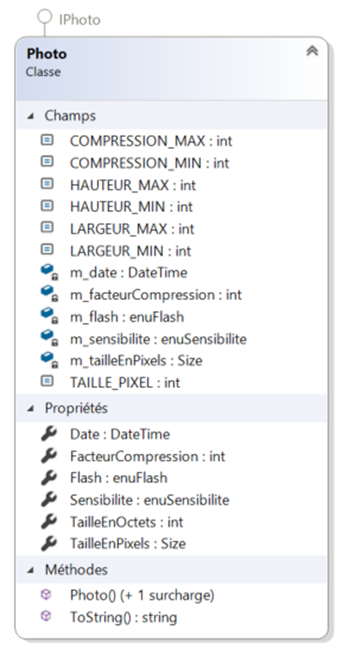
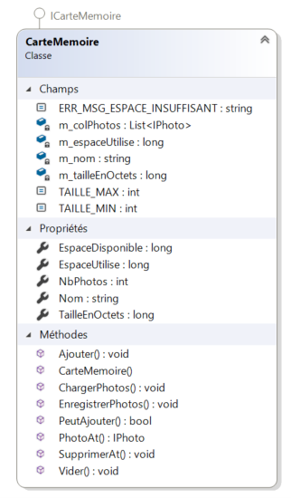

# Camera App

---
 This app simulates the functioning of a camera. It simulates everything from the camera it self, to the picture and even the SD card. 

> Note: This app is a very high level implementation of how a camera would work.

**Below is the step by step taken to develop this app (***IN FRENCH***)**

<br>

<br>

--- 

# Étape #1

---

### Fichier: Enums.cs

* La sensibilité d’une photo &rarr; {ISO_64, ISO_100, ISO_200, ISO_400, ISO_800}
* L’activation du flash &rarr; { Active, Desactive }
* La qualité d’une photo &rarr; { Excellente, Bonne, Moyenne, Faible }
* La dimension d’une photo &rarr; { Maximale, Large, Grande, Moyenne, Petite }

# Étape #2

---

### Définir la classe Photo:IPhoto telle que décrite ci-après.



```csharp
    /// Constants
    public const int TAILLE_PIXEL = 3;
    public const int LARGEUR_MIN = 640;
    public const int LARGEUR_MAX = 8192;
    public const int HAUTEUR_MIN = 480;
    public const int HAUTEUR_MAX = 8192;
    public const int COMPRESSION_MIN = 1;
    public const int COMPRESSION_MAX = 500;
```


# Étape #3

---


### Définir la classe Photo:IPhoto telle que décrite ci-après.



```csharp
    /// Constants
    public const int TAILLE_MIN = 8; //  8 Mo
    public const int TAILLE_MAX = 8192; // 8192 Mo
    public const string ERR_MSG_ESPACE_INSUFFISANT = "Espace insuffisant";
```
